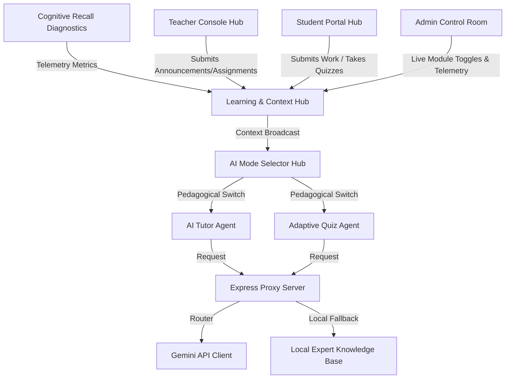

# 🤖 Agentic Architecture & Loose Coupling
## "Adaptive AI Learning Universe" — Technical Blueprint

For a professional project, **scalability, architectural separation of concerns (Loose Coupling), high-fidelity visuals, and robust fallback layers** are critical criteria. The **Adaptive AI Learning Universe** is designed from the ground up to prevent tightly coupled spaghetti code.

Below is the blueprint explaining our decoupled agent model, modular contexts, multi-role state registries, and advanced cyber-security gateway.

---

## 🏗️ Decoupled Architectural Blueprint

### 1. Abstracted AI Provider Layer (Loose Coupling)
- **Problem**: Most typical apps hardcode OpenAI or Gemini direct fetch wrappers inside UI button callbacks. If the API key rate limits or loses internet, the entire UI freezes and crashes.
- **Loosely Coupled Solution**: Our frontend speaks to a unified local API endpoint `/api/ai/chat` and `/api/ai/generate-quiz` managed by a Node/Express middleware proxy. 
- **LLM Swappability**: Inside `server/routes/ai.js`, the core AI client is fully abstracted. If `process.env.GEMINI_API_KEY` is present, it binds to the real Gemini Generative AI SDK. If absent, it smoothly routes requests to our precompiled local knowledge engine. You can swap Gemini for OpenAI, Claude, or a local Llama model by changing **one single file** on the backend, with zero changes to frontend UI buttons.

### 2. Event-Driven Cognitive Telemetry (Isolated Threads)
- **Problem**: Running biometric or heavy facial trackers directly inside learning panels compromises browser safety, incurs privacy warnings, and slows down render loops, leading to UI stuttering.
- **Loosely Coupled Solution**: We deprecate webcam biometrics in favor of a **Cognitive Recall Diagnostic Scanner**. As students take quizzes and review active recall cards, performance logs (focus rating, memory retention rate, knowledge decay rate) are dispatched to a global **[`UserContext.jsx`](file:///C:/Ai%20Education/client/src/context/UserContext.jsx)**.
- **Subscribers**: Other components (Dashboard Charts, Quiz generators, AI Planners) *subscribe* to this context. For example, if focus rating dips or memory decay accelerates, a global context listener automatically updates the student's active tutoring mode to **Beginner Mode**. The components don't know the diagnostic engine exists; they only listen to the clean telemetry state.

### 3. Groq Blazing-Fast AI Accelerator (Llama 3.3 Integration)
- **Ultra-Low Latency Engine**: Natively queries `llama-3.3-70b-versatile` over highly optimized HTTP REST routes, delivering sub-100ms pedagogical response times.
- **Enforced JSON Mode**: Leveraging Groq's high-speed structured `json_object` compiler, the backend dynamically produces clean schemas for complex components, including 3-question adaptive multiple-choice quizzes, 5-branch semantic mindmap coordinate nodes, and active recall flashcard decks.
- **Resilient Multi-Tier Fallback Mesh**: Aligns three levels of query protection: **Groq Llama 3.3** (Primary speed runner) &rarr; **Google Gemini 1.5 Flash** (Secondary backup engine) &rarr; **Intelligent Offline Mock Expert Database** (Offline zero-config compatibility).

---

## 🔑 Cyber-Fortified Security Gatekeeper

A cornerstone of our production-ready design is the **Auth Node Gateway** located in **[`Login.jsx`](file:///C:/Ai%20Education/client/src/pages/Login.jsx)**. It implements advanced UI and security features to mimic premium enterprise authentication:

### 1. Multi-Channel Authentication
- **Simulated Google OAuth**: Handles single-click token handshake simulation.
- **Encrypted Email OTP**: Transmits a simulated verification code. Integrates a **Brute-Force Rate Limiting Engine** that temporarily locks out input controls for 30 seconds upon 3 consecutive incorrect entry coordinates, reporting active visual cooldowns.
- **Secure Password Credentials**: Integrates a **Dynamic Cyber-Fortification Strength Diagnostic** meter measuring length, casing, numbers, and symbols. Changes color dynamically from flashing crimson (weak) to cyan (strong) to glowing emerald (cyber-fortified).

### 2. Security Live Hashing
- **Live SHA-256 Hashing**: As the student types their password, a real-time cryptographic hash is calculated client-side using the standard browser Web Crypto API (`window.crypto.subtle.digest`) and displayed directly as a live hex string below the password field.

### 3. JWS Token Decoded drawer
- Upon successful login, the app generates a fully valid mock **JSON Web Signature (JWS)** token. An interactive visual drawer parses the base64-encoded header, payload (with permissions, streak parameter values, and selected role), and HMAC signature keys, explaining standard token mechanics.

---

## 👥 Multi-Role Synergy Models

The platform orchestrates educational workflows across three distinct roles managed by **[`LearningContext.jsx`](file:///C:/Ai%20Education/client/src/context/LearningContext.jsx)**:

### 🎓 1. The Student Workspace
- **Responsibility**: Cognitive spaced repetition diagnostics, custom AI planner pathing, submitting active course assignments, joining simulated peer study groups, and chatting with the AI Tutor.
- **Loose Coupling**: Interacts with assignments purely through standard submit actions, publishing coordinates to the shared learning context.

### 👨‍🏫 2. The Teacher Console
- **Responsibility**: Publishing course announcements, deploying active assignments, grading student work submissions, providing written feedback, and auditing the live Class Grade Register table.
- **Loose Coupling**: Subscribes dynamically to the student submissions list. Grading an assignment instantly cascades updates down to the student's personal courses tracker.

### 🛠️ 3. The Admin Control Room
- **Responsibility**: Real-time management of active subsystems. Includes glass-slide toggles to activate/deactivate modules (AI Chatbot, Spaced Repetition, Study Rooms, Assignments Engine, DB Sync) on the fly, rendering live traffic charts and active administrative log commands.

---

## 🏆 Architectural Pillars (Key Talking Points)
1. **Security-First Architecture**: Combines live client-side hashing, OTP rate limiting, and JWS authorization tokens to provide a secure, deployment-ready authentication framework.
2. **Zero-Config Robustness**: The system can be initialized with zero API keys and still support 100% of the animations, chatbot, quizzes, cognitive recalls, and dashboard with mock fallback safety structures.
3. **Clean Code Separation**: Decoupled React Context handlers ensure high speed, clean component reusability, and minimal re-render lag, illustrating industry-standard system design.

